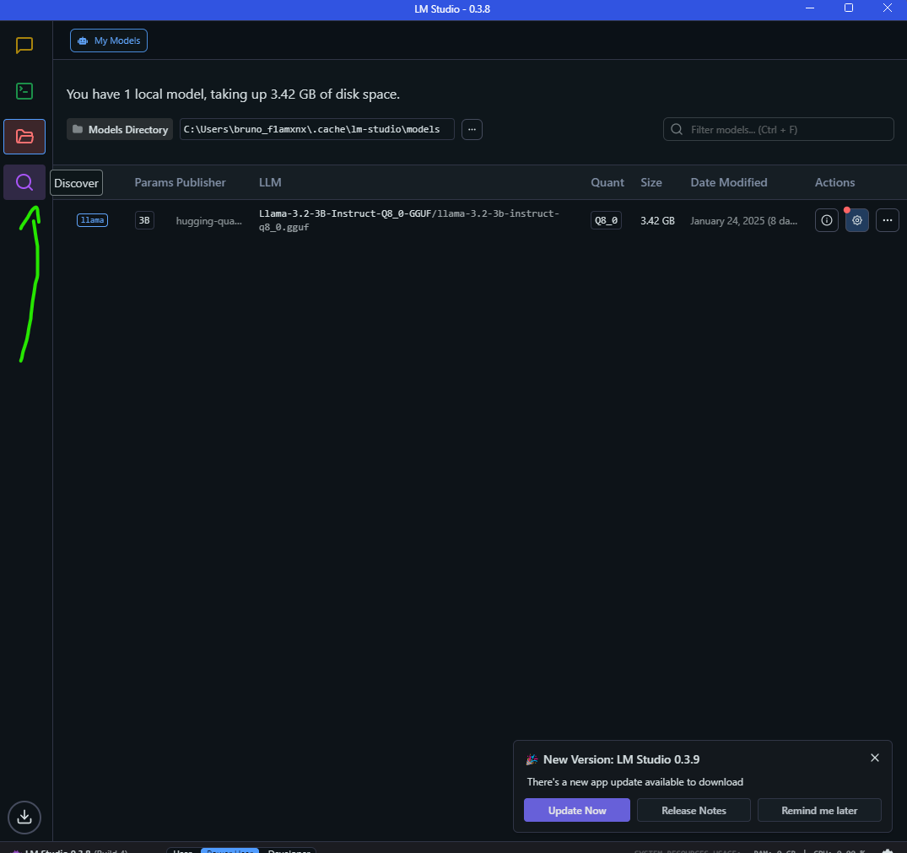
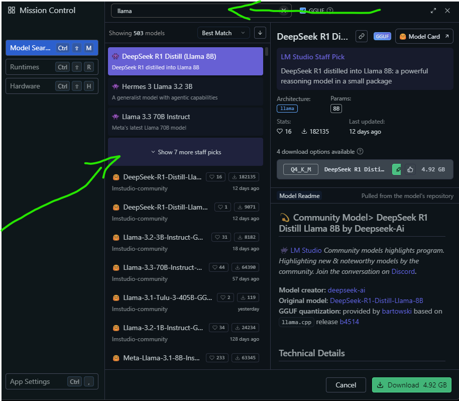
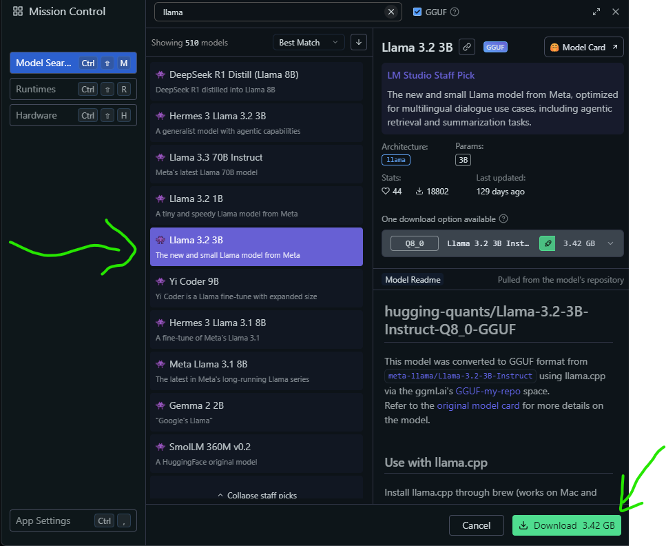
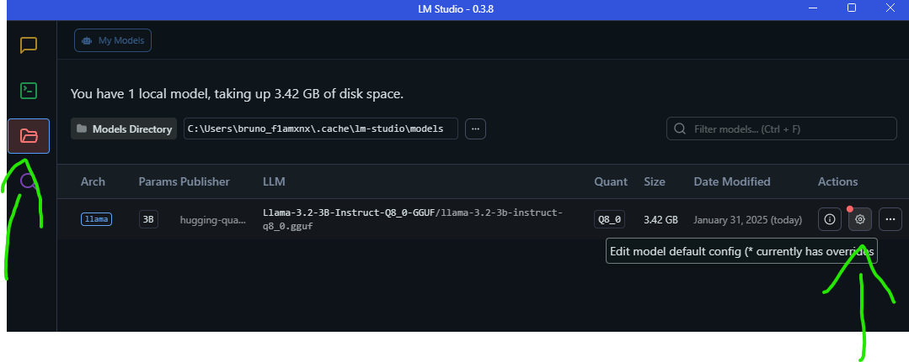
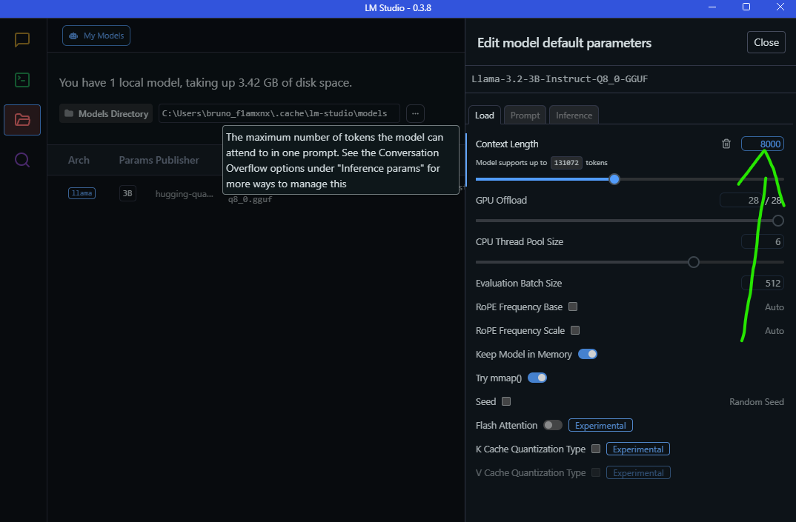
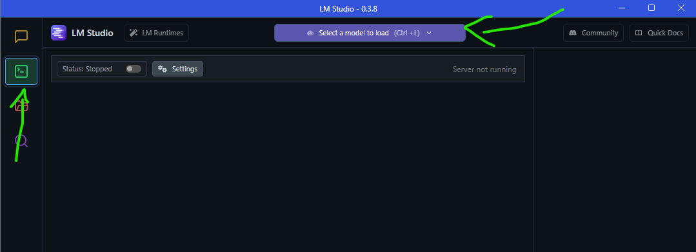
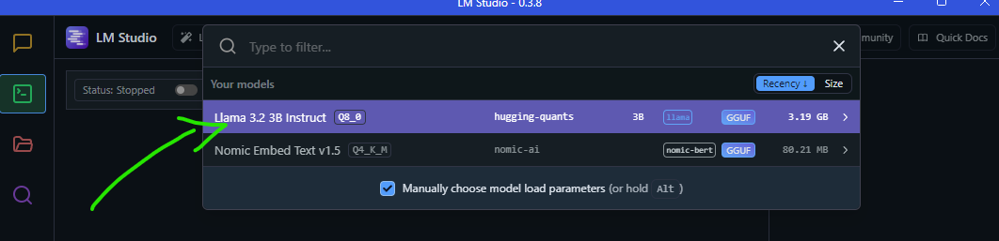
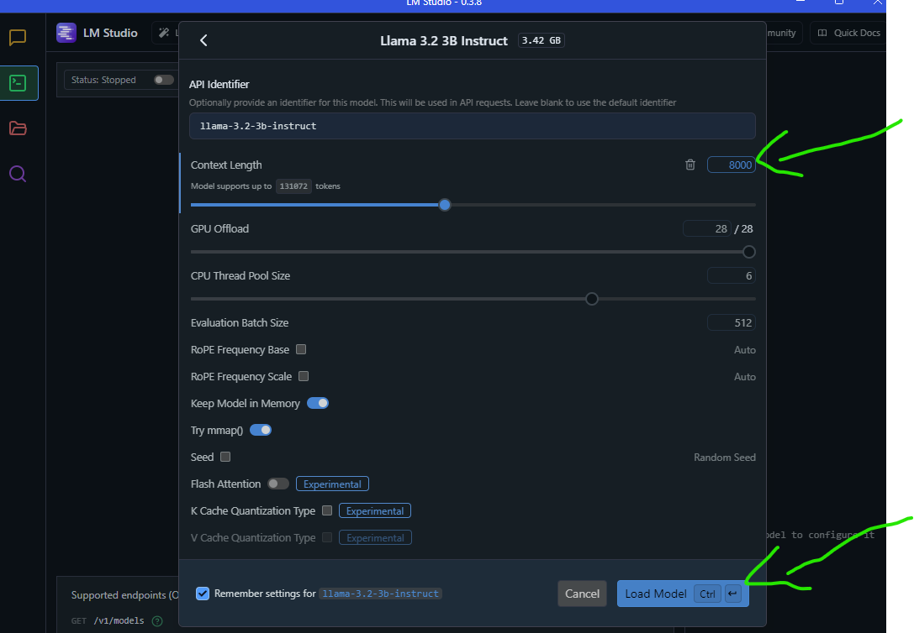
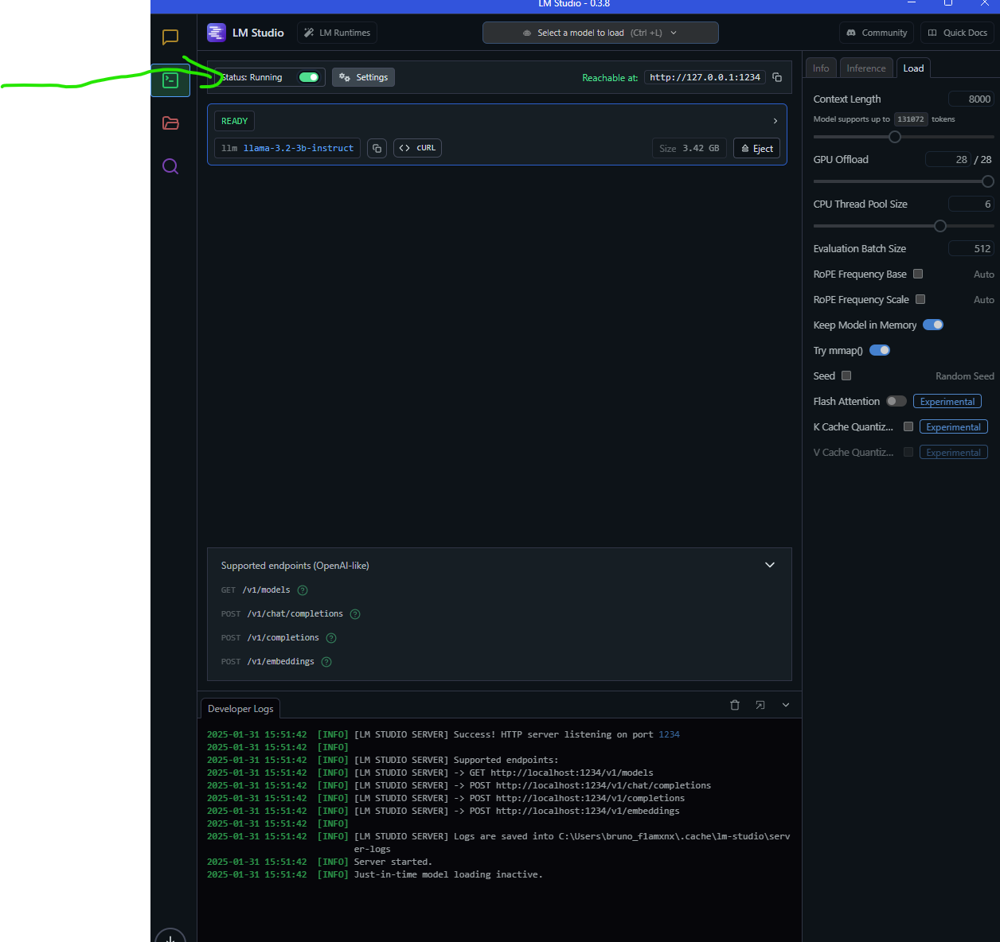

# Projeto FastAPI com Interação de Console

Este projeto é uma API desenvolvida com **FastAPI** que envia textos para a API do LM Studio para gerar resumos estruturados e os salva em um arquivo `.docx`.

## 🚀 Como funciona?

1. O usuário insere um texto que deseja resumir.
2. O texto é enviado para a API do **LM Studio** junto com um prompt de sistema que orienta a IA a gerar um resumo estruturado.
3. A resposta da API é processada e salva como um documento `.docx`.

## 📌 Pré-requisitos

- Python 3.7 ou superior
- pip (Python package installer)
- LM Studio

## Libs instaladas

- FastAPI
- Uvicorn
- Python-dotenv
- requests
- Python-docx

## Instalação

1. Instalar o LM Studio
 Acesse o site do [LM Studio](https://lmstudio.ai/) e faça o download.
 1.2. Acesse a parte de "Discover"
 
 1.3 Digite o nome do modelo, neste caso "llama" (Necessário clicar no "Show 7 more staff picks" para exibir o modelo correto "Llama 3.2 3B")
 
 1.4 Clicar no botão de "Download"
 
 1.5 Retornamos ao "My Models" para configurar o a LLM.
 
 1.6 Sugiro aumentar o numero máxmio de tokens por prompt para 8000
 
 1.7 Para carregar o modelo no servidor, devemos clicar em "Developer" e "Select a model to load"
 
 1.8 Escolhemos o modelo "Llama 3.2 3B Instruct" na lista
 
 1.9 Devemos conferir se o número máximo de Tokens foi alterado e carregar o modelo
 
 1.10 No final, devemos ativar o servidor clicando no botão "Status"
 

2. Clone o repositório:

   ```bash
   git clone https://github.com/Brunoalaraujo/MoscaBranca

3. Crie o ambiente virtual

    ```bash
    python -m venv venv

4. Acesse o ambiente virtual

    ```bash
    venv\Scripts\activate.bat

5. Instale os Requirements

    ```bash
    pip install -r requirements.txt

6. Crie o arquivo com as variáveis de ambiente

    ```env
    MY_URL=http://127.0.0.1:1234/v1/chat/completions
    API_KEY=llama-3.2-3b-instruct

7. Inicie o servidor FastAPI

    ```bash
    uvicorn app:app --reload

## 🚀 Como executar

1. Inicie o servidor FastAPI
2. Execute manualmente o envio de texto e salve o documento:

    ```bash
    python app.py

## 📌 Uso da API

📤 Enviar texto para resumo

Endpoint:

Request Body (JSON):

```
{
  "api_key": "sua_chave_de_api",
  "messages": [
    { "role": "system", "content": "Prompt do sistema para a IA" },
    { "role": "user", "content": "Texto que será resumido" }
  ],
  "max_tokens": 8000
}
```

```

Response (JSON):
```

{
  "choices": [
    {
      "message": {
        "content": "Aqui está o resumo estruturado do seu texto..."
      }
    }
  ]
}

```
